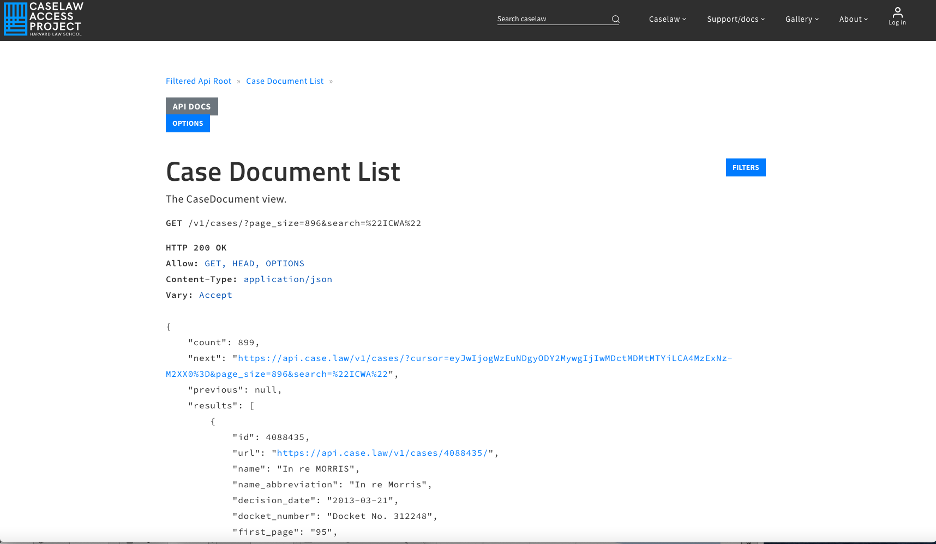
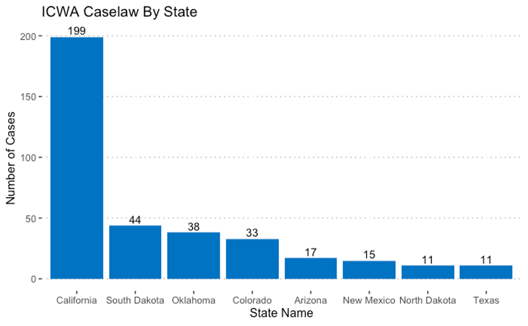
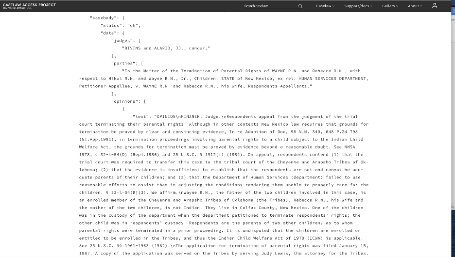
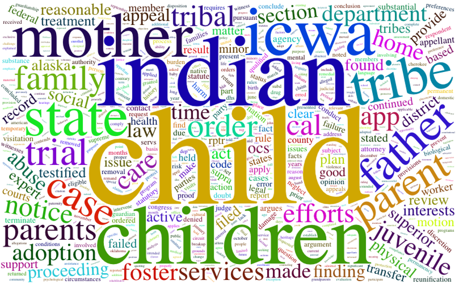

# ICWA-caselaw
The United States government has a long and sordid history of separating children from their parents in this country.  In the mid-1800s public and private agencies were routinely removing minor tribal citizens (hereafter “MTCs”)  from their homes with the Federal Government’s consent. About 100 years later, a Congressional investigation revealed that between 25-35% of MTCs in the US were taken from families by state welfare agencies and that a gross disproportionality existed whereby MTCs were 7-8 times more likely to be removed compared to white children with the vast majority placed in non—Tribal homes with white parents. 
Much of the disproportionality had to do with the biases and prejudice of multiple systems of oppression working in conjunction to remove children out of ignorance of tribal customs and out of a failure to recognize the cultural and social standards prevailing in indigenous communities.

In response to the wholesale removal of children from indigenous households, the US government enacted the "Indian Child Welfare Act" (ICWA) in 1978. The ICWA (25 U.S.C. §1902) which was enacted by congress in accordance with its authority under the Indian commerce clause, has been described as a "monumental piece of legislation" that affects every Native American child born in the united states (Fletcher, 2007). This past year myself and two students wanted to better understand the context of the ICWA from a spatial epidemiological perspective. We first undertook an analysis of ICWA caselaw to better understand why, despite this legislation, Native American children continue to be disproportionately represented in the foster care system 50 year after its enactment. Our main interest was to better understand the reasons for why families are being dissolved for the purpose of creating sensitive and effective interventions. 

Here, we describe the first step of our analysis, namely to identify and download a corpus of ICWA caselaw. Thereafter, it is possible to analyze the caselaw (i.e. the text) using more advanced textual analysis and data science tools.

The Harvard Law School provides a way to access ICWA caselaw data fairly easily. The Harvard Law School's Caselaw Access Project can be accessed here https://case.law. The R script will download all available ICWA cases into an R data frame object for further analysis.

Legal documents are very complicated. Luckily, the Harvard Law School provides a way to access caselaw data fairly easily. The data for this analysis comes from Harvard Law School's Caselaw Access Project which can be accessed here https://case.law. The Caselaw Access Project ("CAP") expands public access to U.S. law by providing a searchable database and an Application Programming Interface (”API”). The goal of this project is to make all published U.S. court decisions freely available to the public online, in a consistent format, digitized from the collection of the Harvard Law Library. [Click here](https://today.law.harvard.edu/caselaw-access-project-launches-api-and-bulk-data-service/) to learn more about Harvard's CAP. 

Here is a short video from Harvard law School announcing the Caselaw Access Project at case.law.
[](http://www.youtube.com/watch?v=kwlN_vhai84 "CAP")

The first step is to access all ICWA caselaw data which is available through the Harvard API here https://api.case.law/v1/cases/?page_size=896&search=%22ICWA%22. The data includes an ID, case name, decision date, docket number, parties, jurisdiction, cases cited and full text, among other things. The graphic below is a snapshot of the results from the link above. Notice that there are 899 cases available for download.



In this chunk of code, we access the caselaw data, store the resulting data into a json object and then convert it to a tibble data set in R.

```{r}
base_url = "https://api.case.law/v1/cases/?page_size=896&search=%22ICWA%22"
get_cases <- httr::GET(url = base_url)
get_cases <- httr::content(get_cases, as="raw")
json <- jsonlite::fromJSON(rawToChar(get_cases))
icwa_cases <- tibble::as_tibble(json$results)
``` 
Here, we summarize the number of cases that come from seven jurisdictions ("Texas","California", "Oklahoma", "Arizona", "Colorado", "South Dakota", "New Mexico", "North Dakota", "Oklahoma") with relatively large shares of Native American children. Then we plot it using ggplot in R.

```(r)
df<- icwa_cases$jurisdiction %>%
  dplyr::group_by(name_long) %>%
  dplyr::filter(name_long %in% c("Texas","California", "Oklahoma", "Arizona", "Colorado", "South Dakota", "New Mexico", "North Dakota", "Oklahoma")) %>%
  dplyr::summarise(counts = n())

ggplot(df, aes(x = reorder(name_long, -counts), y = counts)) +
  geom_bar(fill = "#0073C2FF", stat = "identity") +
  geom_text(aes(label = counts), vjust = -0.3) + 
  theme_pubclean() + ggtitle("ICWA Caselaw By State") +
  xlab("State Name") + ylab("Number of Cases")
```


In order to get the full text we need to set the option ‘full_case = true.’ For example, the url to access the full case text for case number 1597254 is https://api.case.law/v1/cases/1597254/?full_case=true



```(r)
case_url = "https://api.case.law/v1/cases/1597254/?full_case=true"
# Replace the XXXX with your own token
auth_header <- httr::add_headers('Authorization' = 'Token XXXX')
get_case <- httr::GET(url = case_url, auth_header)
get_case <- httr::content(get_case, as="parsed")
```

Now loop through all of the cases and store the full case text and case ID. If no text is available we just move to the next record.

```(r)
# create an empty data frame
df <- setNames(data.frame(matrix(ncol = 2, nrow = 0)), c("id", "text"))

#loop through all icwa cases and store in the dataset
for (i in 1:nrow(icwa_cases)){
  tryCatch({
    get_case_url = paste0(icwa_cases[i,2],"?full_case=true")
    get_case_url <- httr::GET(url = get_case_url)
    get_case_url <- httr::content(get_case_url, as="parsed")
    if (!is.null(get_case_url$casebody[[2]])) {
      df[i,1] <- get_case_url$id
      df[i,2] <- get_case_url$casebody[[2]][3]$opinions[[1]]$text
     }
  }
    , error=function(e){cat("ERROR :",conditionMessage(e), "\n")})
}
df <- df[complete.cases(df), ]
```

The wordcloud2 library was used to create the following wordcloud on the term document matrix after the data were cleaned. 


There are several words that stand out in addition to the obvious ones. For example, abuse, adoption, transfer, health, neglect and expert might be subjects worthy of further investigation. Once we have the data in R, it is easy to identify the case law that contains these words. It is also possible to perform additional text analysis and more advanced methodology such as Latent Dirichlet Allocation modeling to better understand the categories of cases. In sum, the Harvard Caselaw API allows researchers, lawyers and policymakers to dig deeper into the case law to better understand the issues that surround child welfare for the purpose of creating more effective and sensitive interventions.

**References**

Fletcher, Mathew (2007). "ICWA and the Commerce Clause." Availabe at: https://www.law.msu.edu/indigenous/papers/2007-06.pdf
Caselaw Access Project, Harvard Law School. Available at https://case.law
